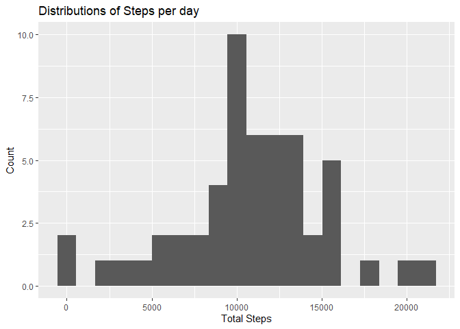
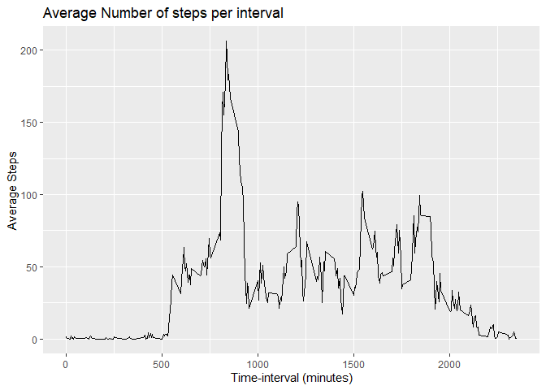
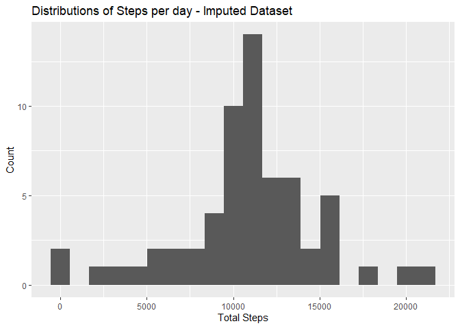

## Loading and preprocessing the data

First, we import the packages we will use in the assignment. The original file is unziped and then we can read the data directly from the source file.

```r
library(dplyr)
library(data.table)
library(ggplot2)
library(timeDate)

unzip('activity.zip')
dt<-fread('activity.csv')
```

## What is mean total number of steps taken per day?
To know the number of steps taken per day, we group the data and calculate the sum of steps for each day. Missing values are filtered from the calculation. The histogram is plotted next.


```r
options(scipen=1, digits=2)
per_day<-dt %>% group_by(date)%>% 
    filter(!is.na(steps)) %>% 
    summarise(total = sum(steps))

ggplot(data = per_day, aes(total))+
    geom_histogram(bins = 20)+
    labs(title = "Distributions of Steps per day", x="Total Steps", y = 'Count')
```

<!-- -->

```r
mean_value<-mean(per_day$total)
median_value<-median(per_day$total)
```

According to our calculations, the **mean value** is 10766.19 and the **median** is 10765

## What is the average daily activity pattern?

Next, we calculate the average number of steps by time interval. The procedure is similar as before, but we know group by 'interval' and compute the mean value for each one.

```r
by_interval<-dt%>%
    filter(!is.na(steps))%>%
    group_by(interval)%>%
    summarise(avg_steps=mean(steps))

ggplot(data = by_interval, aes(x=interval, y=avg_steps))+
    geom_line()+
    labs(title = "Average Number of steps per interval", x="Time-interval (minutes)", 
         y = 'Average Steps')
```

<!-- -->

```r
max_interval<-by_interval$interval[which.max(by_interval$avg_steps)]
```

The plot shows that the average number steps is front loaded: higher in the morning and lower through the rest of the day. The sleep hours show very little steps as expected. The **interval with the highest average step number** is 835.

## Imputing missing values
The imputation process is based on assigning the average step number for each interval. We look for each 'NA' value in the 'steps' column, look for the corresponding average number in 'by_interval' dataframe and store them in a vector, which is later assigned to a new dataset. The histogram for the new dataset is plotted.


```r
imputed_data<-with(by_interval,
                    avg_steps[match(dt$interval[is.na(dt$steps)],interval)])

dt_imputed<-dt
dt_imputed$steps[is.na(dt_imputed$steps)]<-imputed_data

per_day_imp<-dt_imputed %>% group_by(date) %>% summarise(total = sum(steps))

ggplot(data = per_day_imp, aes(total))+
         geom_histogram(bins = 20)+
         labs(title = "Distributions of Steps per day - Imputed Dataset", 
              x="Total Steps", y = 'Count')
```

<!-- -->

```r
mean_value_imp<-mean(per_day_imp$total)
median_value_imp<-median(per_day_imp$total)
```

The step number distribution is quite similar, but with a higher data count and a higher frequency for the center of the distribution. The **mean value** with imputed data is 10766.19, which is the same value as before since we introduced only average steps counts for each interval. The **median** is 10766.19 which is equal to the mean and slightly higher than before.


## Are there differences in activity patterns between weekdays and weekends?

First, we assign a new column indicating if the record corresponds to a weekday or the weekend. Then, the average step count is calculated just like before, and a time series grouped by type of day is plotted.


```r
dt_imputed$Is_Wday<-factor(isWeekday(dt$date, wday=1:5),
                           levels=c(TRUE, FALSE), 
                           labels=c('Weekday','Weekend')) 

by_interval_imp<-dt_imputed%>%
    group_by(Is_Wday,interval)%>%
    summarise(avg_steps=mean(steps))

ggplot(data=by_interval_imp,aes(x=interval,y=avg_steps))+
    geom_line()+
    facet_grid(Is_Wday~.)+
    labs(title = "Average Number of steps per interval - Grouped by Type of Day",
         x="Time-interval (minutes)", 
         y = 'Average Steps')
```

<!-- -->

Both time series follow the same pattern, but the weekdays show a higher step count in the morning, which is expected as the work day starts early during the week. At night, on the other hand, there is a higher step count in the weekends, since people tend to sleep later on those days.
